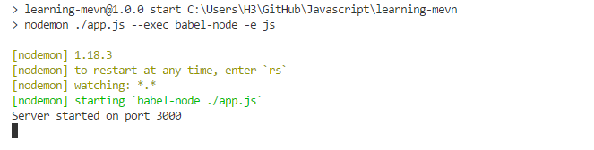

# Documentación del curso Express.js Node.js & MongoDB

Documentación del curso llevado a cabo de la plataforma de Udemy.

## ¿Qué es express.js?
`Express.js` es un Framework para Node.js para aplicaciones web, minimalista y flexible, que provee un robusto conjunto de características para aplicaciones web y móviles.

## ¿Qué es Node Package Manager (npm)
Npm es el manejador de paquetes de Node.js, npm registra una colección de paquetes públicos de open-source para Node.js, front-end web apps, mobile apps, robots, routers y demás.

---

## Creación de la aplicación
Para iniciar un proyecto es necesario crear una carpeta y dentro de ella ejecutar el siguiente comando:

>`npm init`

Que creará un archivo de nombre `package.json` que es un archivo donde reciden los datos de la aplicación, configuración de comandos y dependencias que usará el proyecto, cuando se descargue el proyecto en otra computadora, `npm` tomará en cuenta este archivo e instalará las dependencias que se registraron en este archivo.

Después, se crea un simple archivo llamado `app.js` que es el que se ejecutará desde `Node.js`, con el siguiente contenido.

```javascript
console.log('Hello World with Node and Express');
```

Y para configurar el comando que se ejecutará desde `Node.js` se abre el archivo `package.json` y se configura el comando `start` y deja similar a lo siguiente: 

```json
{
  "name": "learning-mevn",
  "version": "1.0.0",
  "description": "",
  "main": "index.js",
  "scripts": {
    "start": "node ./app.js",
    "test": "echo \"Error: no test specified\" && exit 1"
  },
  "repository": {
    "type": "git",
    "url": "git+https://github.com/AngelGuerrero/learning-mevn.git"
  },
  "author": "Ángel Guerrero",
  "license": "ISC",
  "bugs": {
    "url": "https://github.com/AngelGuerrero/learning-mevn/issues"
  }
}

```
Lo siguiente es instalar las dependencias que nos permitirán usar ES6, ejecutando lo siguiente desde una terminal:

> `npm i -D babel-cli babel-preset-env babel-preset-stage-0`


Lo siguiente es modificar el comando `start` dentro del archivo `package.json` para comenzar a utilizar babel, lo cual el comando quedaría de la siguiente forma:

`"start": "node ./app.js --exec babel-node -e js",`

Así tenemos la posibilidad de usar ES6.

Una cosa más que se tiene que hacer es crear un archivo de nombre `.babelrc` y ahí se configura de la siguiente manera:

```json
{
    "presets": [
        "env",
        "stage-0"
    ]
}
```


### Instalando Express.js

Primero se instala un paquete de nombre `nodemon` que sirve para el hot-reload, con el siguiente comando:

>`npm i -D nodemon`

Y en el archivo de configuración `package.json` cambiar la siguiente línea del comando `start`.

`"start": "nodemon ./app.js --exec babel-node -e js",`

Para instalar Express.js simplemente hay que ingresar desde la terminal lo siguiente:

>`npm i -S express`

E instalará los paquetes necesarios y la versión más actual.

Ahora se puede probar el siguiente código en el archivo `app.js`.

```javascript
import express from 'express';

const PORT = 3000;

const server = express();

server.listen(PORT, () => console.log(`Server started on port ${PORT}`));
```




